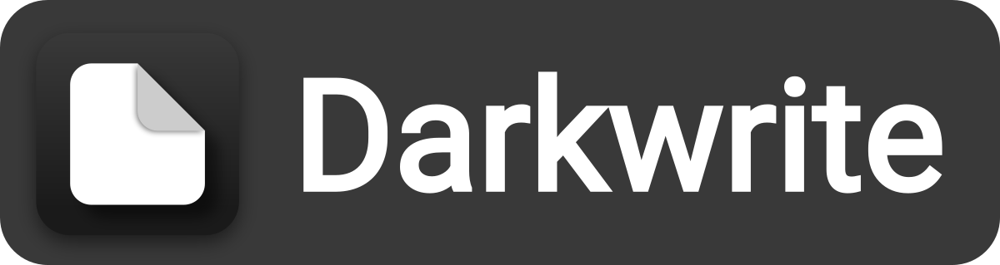

  
  

### Notes and todo, the way you want.
[Follow me on Twitter](https://twitter.com/codingwithburak)  
Darkwrite is a simple and easy way to organize your notes and todos. 
### Customization beyond expectations
The look and feel is very tweakable. You can change the color theme as well as the user interface font. You can also add a wallpaper if you want to. You can change the font of each note individually as well.
### Your todos right by your side
Todos are displayed on a sidebar, and you can drag them around as you wish.
### Cross platform
The application is built on web technologies and Rust, which makes it possible to run the app on Windows, Linux and macOS.
### Every note is unique
Your notes will be the most colorful and the most enjoyable to look at. Change the colors and the font of your notes individually, making all of them your own.
### Organize your notes with notebooks
You can easily move your notes to another notebook, or create a new one, by right clicking your notes.

# Development Status
The application is nearly feature complete for first release. It's much more stable than before, and it's usable in it's current state. However it's not very well tested and there may be minor changes ahead, which may cause major headaches later.   
The development roadmap until first stable release will mostly form around optimization and UX improvements as well as writing documentation. Every part of code will be documented in detail, which would make it easier for others to contribute.
A website will be launched on GitHub Pages, which will live inside this repository.
Feel free to create an issue if you have any suggestions :)

# Building
See [BUILDING.md](docs/BUILDING.md)

# License
Licensed under GNU General Public License, version 3 or any later version at your option.
