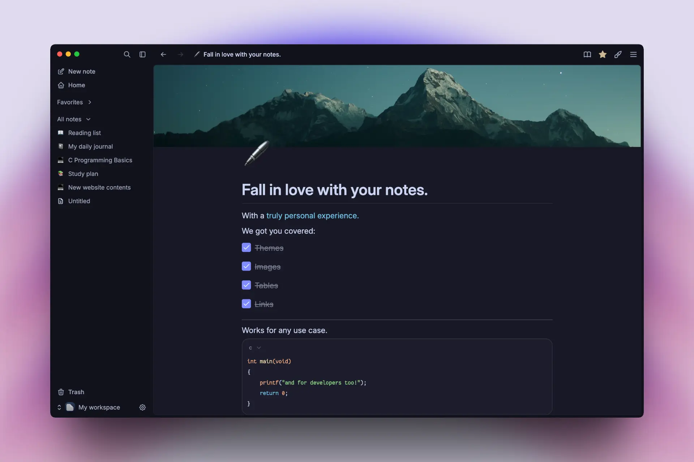
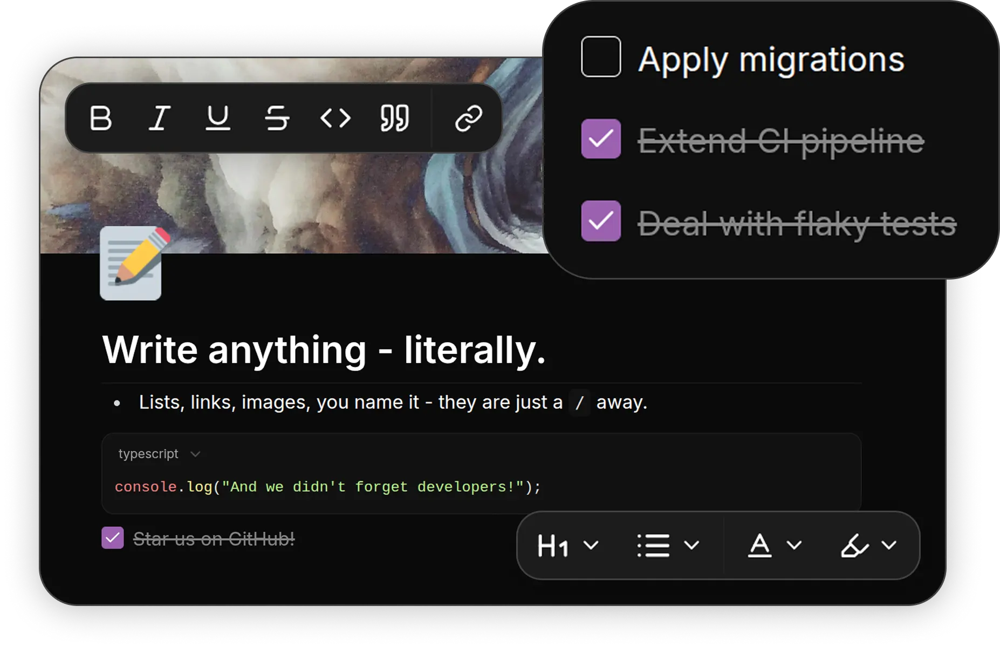
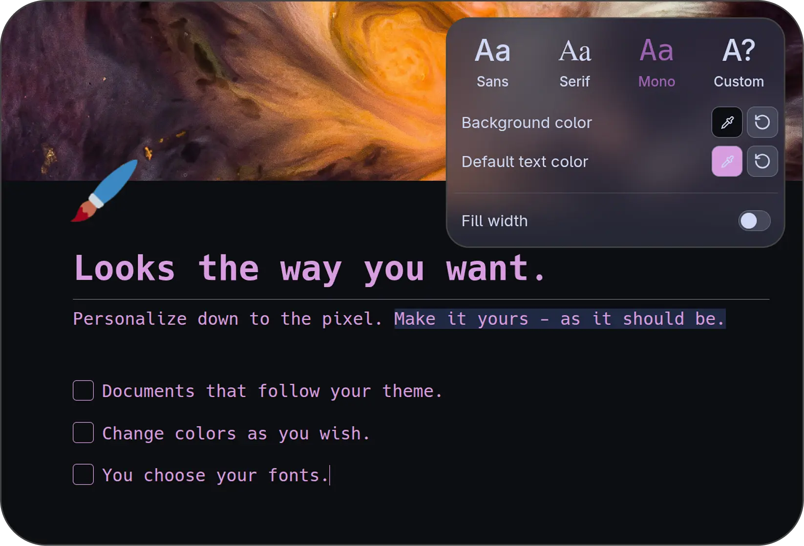

    
    
    
    
    

<strong>

    <a href="https://twitter.com/codingwithburak">Follow on Twitter</a> -
    <a href="https://github.com/astudentinearth/darkwrite/releases">Download Darkwrite</a> -
    <a href="https://github.com/astudentinearth/darkwrite/issues">Report bugs</a>

</strong>

# **Write without distractions.**

Darkwrite leaves you alone with your notes, **without noise.**
- No forced AI features.
- No subscriptions.
- No internet needed, works fully offline.
- No ads.
- No tracking.

**Head over to the [releases page](https://github.com/astudentinearth/darkwrite/releases) to get started.**

⭐ Star this repository to know when we release new updates.

## 🖊️ Just start typing.

Unleash the power of a rich editor which supports formatting, headings, todo lists, numbered lists, links to files, resizable images, colorful code blocks, tables, and custom properties.

## 🖌️ Make it yours.

Choose from the selection of included themes, [or create your own](https://darkwrite.app/docs/functionality/themes/). Say goodbye to boring light and dark themes.

Pick the fonts you like. You can change the default styles for your notes or choose a font you like only for one specific note. You can also change the user interface font and everything else will follow suit.

Add icons or cover images to your notes.

## 🔒 Open and private.

Darkwrite's source code is right here. It does not collect **any of your data.** All your notes are stored locally on your device.

Darkwrite has no AI features [by design.](https://github.com/astudentinearth/darkwrite/issues/20#issuecomment-4058940266)

You are never locked in. Export all your notes as HTML files, and you can use them anywhere else. Need to backup your data? Get an archive with just one click and restore them later if you need it.

## 🖥️ Work offline.

Everything stays on your device, and you never need an internet connection. Your thoughts are always available.

## Docs

- [Building Darkwrite](docs/BUILDING.md)
- [Development docs](docs/DEVELOPMENT.md)

For everything else, see [the docs folder](docs)

## Contributing

See [CONTRIBUTING.md](./CONTRIBUTING.md) to get started❤️

Feel free to raise an issue or discussion if you have any questions.

### Translators
- Simplified Chinese contributed by @wcxu21

## License

Darkwrite is free and open source, licensed under GNU Affero General Public License, version 3 or any later version at your option.  
Licenses for 3rd party packages used to make Darkwrite possible can be found [here.](https://github.com/astudentinearth/darkwrite/blob/dev/packages/app-desktop/THIRDPARTY.md)
